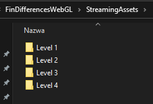
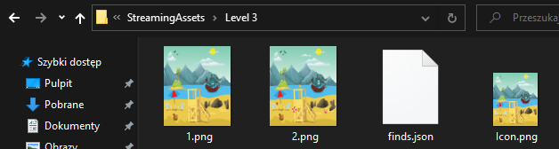
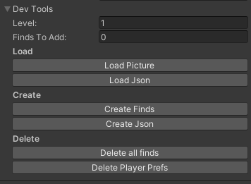

# Find-Differences
To add/edit levels you don't need to build anything, everything is automatically loaded from Streaming Assets. In the streaming assets folder there are folders with levels and in these folders there are 4 files:
- 1.png and 2.png are images that are different
- icon.png a smaller version of the image that is loaded in the menu so that it does not take too long to download all 20 levels.
- finds.json it stores information where the differences are located 
  
   

To create such a .json file in unity, I prepared tools. These tools allow you to open an existing json file for corrections, create a new one, load images, etc.

coming soon
